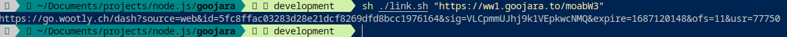

# Video Url Extractor

Simple bash / node script to extract  [Goojara](https://goojara.ch) / [Wootly](https://go.wootly.ch) video urls. Handles the random advert redirects and just returns the video url.



### Installation

1.
```bash
git clone https://github.com/richard-muvirimi/goojara-wootly-url-extractor
```

2.
```bash
yarn install
```

### Usage

On linux shells
```bash
sh ./link.sh "video-page-url"
> https://go.wootly.ch/dash...
```

Using node.js directly
```bash
node index.js "video-page-url"
> https://go.wootly.ch/dash...
```

### License

```license
Copyright 2023 Richard Muvirimi

Licensed under the Apache License, Version 2.0 (the "License");
you may not use this file except in compliance with the License.
You may obtain a copy of the License at

    http://www.apache.org/licenses/LICENSE-2.0

Unless required by applicable law or agreed to in writing, software
distributed under the License is distributed on an "AS IS" BASIS,
WITHOUT WARRANTIES OR CONDITIONS OF ANY KIND, either express or implied.
See the License for the specific language governing permissions and
limitations under the License.
```