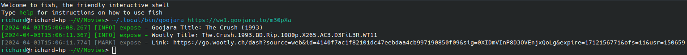

# Video Url Extractor

Simple bash / node script to extract [Goojara](https://goojara.ch) / [Wootly](https://go.wootly.ch) video urls. Handles the random advert redirects and just returns the video url.



### Installation

1.
    ```bash
    git clone https://github.com/richard-muvirimi/goojara-wootly-url-extractor
    ```

2.
    ```bash
    yarn install
    ```
    or
    ```bash
    npm install
    ```

### Usage

Depending on your environment run either of the following commands.

*unix shells (bash, zsh, etc)
```bash
sh ./link.sh "video-page-url"
> Goojara Title: Movie Title (1970)
> Wootly Title: Movie.Title.1970
> LINK: https://go.wootly.ch/dash...
```

Windows Terminal
```bash
./link.bat "video-page-url"
> Goojara Title: Movie Title (1970)
> Wootly Title: Movie.Title.1970
> LINK: https://go.wootly.ch/dash...
```

Docker
```bash
docker run ghcr.io/richard-muvirimi/goojara-wootly-url-extractor:release expose "video-page-url"
> Goojara Title: Movie Title (1970)
> Wootly Title: Movie.Title.1970
> LINK: https://go.wootly.ch/dash...
```

Node.js Directly
```bash
node index.js expose "video-page-url"
> Goojara Title: Movie Title (1970)
> Wootly Title: Movie.Title.1970
> LINK: https://go.wootly.ch/dash...
```

Exported Command (if you exported the script to your path)
```bash
goojara "video-page-url"
> Goojara Title: Movie Title (1970)
> Wootly Title: Movie.Title.1970
> LINK: https://go.wootly.ch/dash...
```

#### Alternatively you can export the script to your path and use it as a command.

###### Installation
*unix shells (bash, zsh, etc.)
```bash
npm run path:linux
````

Windows Terminal
```bash
npm run path:windows
```

Docker
```bash
npm run path:docker
```

###### Uninstallation

*unix shells (bash, zsh, etc.)
```bash
npm run unpath:linux
```

Windows Terminal
```bash
npm run unpath:windows
```

###### Usage

*unix shells (bash, zsh, etc.), Windows Terminal, and Docker
```bash
goojara "video-page-url"
```

The script can be more verbose by setting the `--verbose` argument, see help below for usage.

### Docker Support

This project includes full Docker support. For detailed instructions on building, running, and deploying with Docker, please see [README.Docker.md](./README.Docker.md).

Quick Docker examples:

Build and run locally:
```bash
docker build -t goojara-url-extractor .
docker run goojara-url-extractor expose "video-page-url"
```

Use pre-built image:
```bash
docker run ghcr.io/richard-muvirimi/goojara-wootly-url-extractor:release expose "video-page-url"
```

### Help

To view additional options provided by the script run either of the following commands depending on environment.

Node.js Directly
```bash
node index.js --help
```

*unix shells (bash, zsh, etc.)
```bash
sh ./link.sh --help
```

Windows Terminal
```bash
./link.bat --help
```

Docker
```bash
docker run ghcr.io/richard-muvirimi/goojara-wootly-url-extractor:release --help
```

Exported Command (if you exported the script to your path)
```bash
goojara --help
```

### System Requirements

- Node.js >= 16.x
- Google Chrome (required for Puppeteer)

### License

```license
Copyright 2023 Richard Muvirimi

Licensed under the Apache License, Version 2.0 (the "License");
you may not use this file except in compliance with the License.
You may obtain a copy of the License at

    https://www.apache.org/licenses/LICENSE-2.0

Unless required by applicable law or agreed to in writing, software
distributed under the License is distributed on an "AS IS" BASIS,
WITHOUT WARRANTIES OR CONDITIONS OF ANY KIND, either express or implied.
See the License for the specific language governing permissions and
limitations under the License.
```